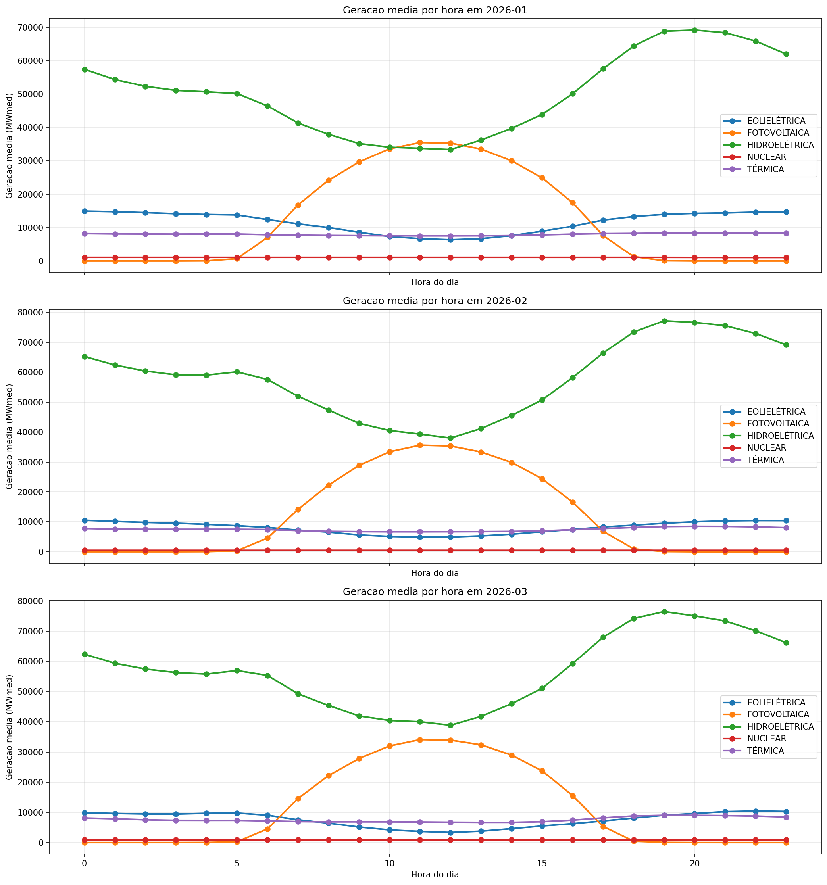
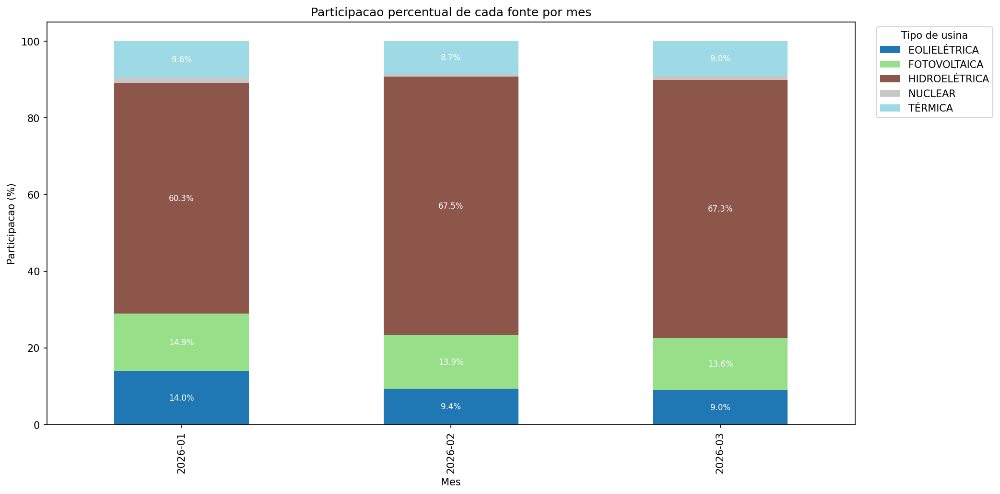
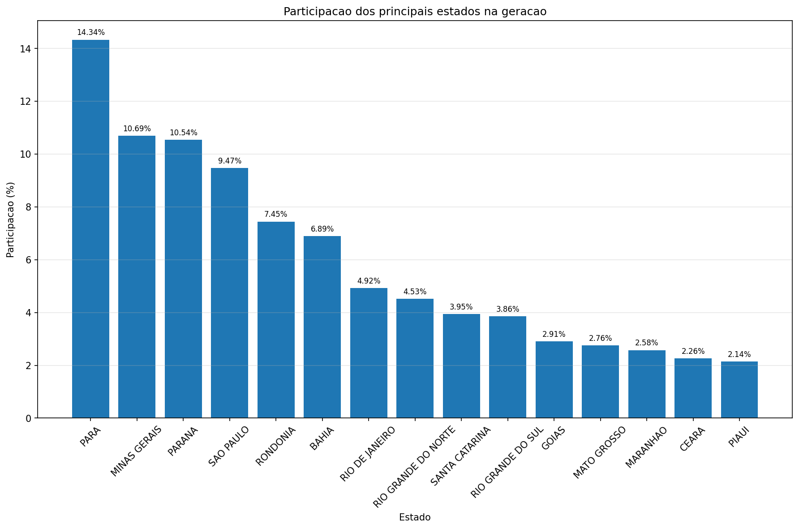
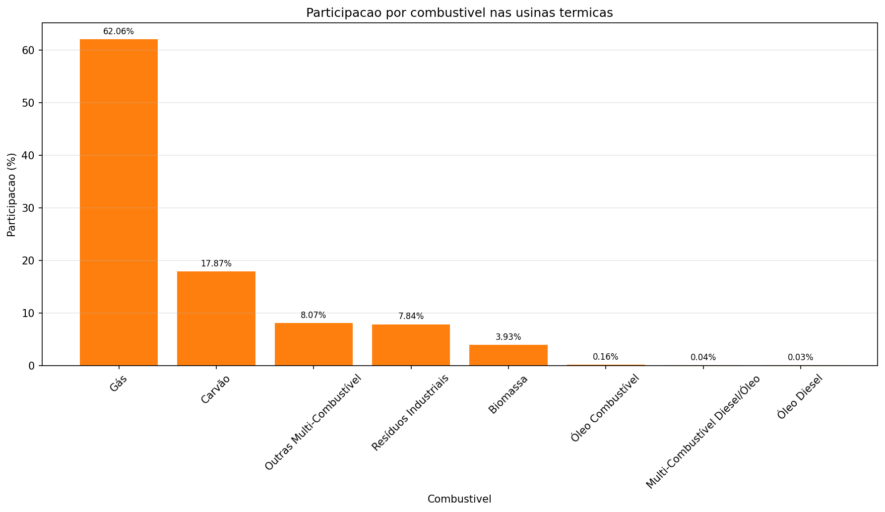
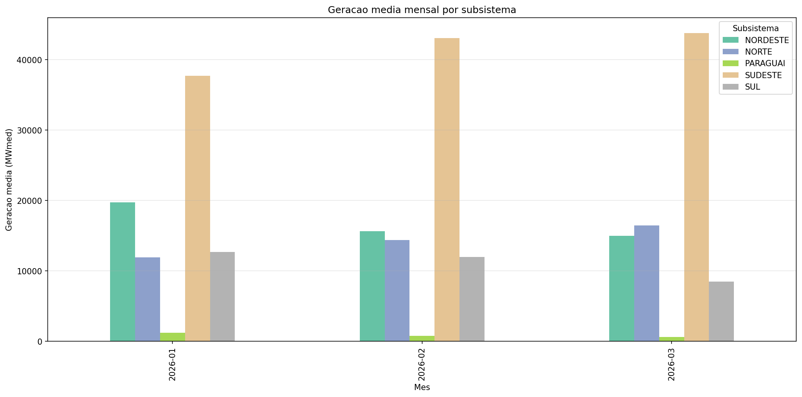

# Relatorio Silver

## Resumo da camada

- Linhas na Bronze: 1245707
- Linhas na Silver: 1245707
- Linhas removidas no tratamento: 0
- Duplicatas removidas: 0
- Arquivo Parquet: `data/silver/geracao_usina_silver.parquet`

## Contagem de nulos

```text
                        null_count
din_instante                     0
id_subsistema                    0
nom_subsistema                   0
id_estado                        0
nom_estado                       0
cod_modalidadeoperacao           0
nom_tipousina                    0
nom_tipocombustivel              0
nom_usina                        0
id_ons                           0
ceg                              0
val_geracao                      0
```

## Tipos de colunas

```text
                                 dtype
din_instante            datetime64[us]
id_subsistema                   string
nom_subsistema                  string
id_estado                       string
nom_estado                      string
cod_modalidadeoperacao          string
nom_tipousina                   string
nom_tipocombustivel             string
nom_usina                       string
id_ons                          string
ceg                             string
val_geracao                    float64
```

## Estatisticas descritivas

```text
                 count   mean     std  min      max
val_geracao  1245707.0  126.9  427.28  0.0  8570.96
```

## Graficos

### 1. Geracao por hora e por mes com `nom_tipousina` na legenda


### 2. Participacao de cada fonte por mes


### 3. Participacao por estado


### 4. Participacao por combustivel nas termicas


### 5. Geracao mensal por subsistema

